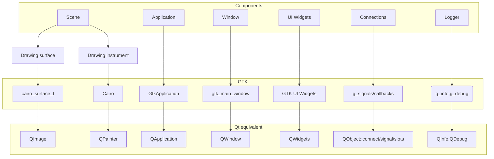

# EZGL Qt migration plan

## Goal:
- to have a seamless incremental migration, where it is possible to validate the result (compare with the original GTK approach at each stage)
- to perform the GTK-to-Qt migration for each component individually
  
Below is flow chart, where EZGL is splited into a components.




## Idea:
- try to keep the API as close to the original as possible, because of this, a 1-to-1 mapping is preferable whenever possible. Put all mapping code into a separate file, as this is a temporary (intermediate) solution.
- If direct type mapping is not possible, add a proper Qt implementation. If implementing a feature is complex and can be postponed (not required for the main flow, e.g. exporting the scene to PDF), wrap it with a macro and hide it.
- to get a buildable and runnable project ASAP, where the migration of each individual component will be easy to test (using the EZGL basic application from the examples).
    
## Steps:

1. Define the EZGL_QT macro and hide all GTK/Cairo headers in all source files.
2. For each component from the flow chart, hide its implementation under its own unique macro.
for example HIDE_GTK_EVENTS, HIDE_GTK_UI_WIDGETS, HIDE_CAIRO:
```cmake
    target_compile_definitions(
        ${PROJECT_NAME}
        PUBLIC
        EZGL_QT
        HIDE_GTK_EVENTS
        HIDE_GTK_UI_WIDGETS
        HIDE_CAIRO 
        # ...
    )
```


3. Make the EZGL project buildable.
4. Unhide a single component and put all effort and focus into implementing all the required API for it. For instance, we can start the port by implementing Cairo: remove the HIDE_CAIRO macro and map/implement all required Cairo API.

**Note:** Cairo requires some Application(QApplication) class and target Widget(QWidget) is implemented, so here will be a bit more work aoutside the Cairo migration scope.

4.1 map types 1 to 1 whenever it's possible.
for instance:
```code
#ifdef EZGL_QT
// ...
#include<QImage>
// ...
using cairo_surface_t = QImage;
// ...
#endif
```
Here in the code we continue using cairo_surface_t name in Qt application, this allow to keep existed API signature the same. This is temprorary solution, but it allows to get MVP asap. 
Put all mapping types into a separate file, let's call it:

```bash
_qtcompat.cpp
_qtcompat.h
```
4.2 If quick type mapping is not possible, add Qt implementation, separated to GTK impl.
For example:

```code
void renderer::draw_text(point2d point, std::string const &text, double bound_x, double bound_y) {
// common impl
#ifdef EZGL_QT
// qt impl
#else 
// gtk impl
#endif 

// common impl
```
So here, API remains the same, but implementation is different based on the selected toolkit (GTK or Qt).


## Cairo -> QPainter migration

<div style="display: flex; gap: 20px;">

```mermaid
flowchart TD
  cairo_t
  text
  geometry
  cairo_surface_t
  widget[GTK Widget]
  
  cairo_t -->|draw API| geometry
  cairo_t -->|draw API| text
  geometry --> cairo_surface_t
  text --> cairo_surface_t

  cairo_surface_t -->|used| widget
  widget --> screen
 ```
```mermaid
flowchart TD
  qpainter[QPainter]
  text
  geometry
  qimage[QImage]
  
  qpainter -->|draw API| geometry
  qpainter -->|draw API| text
  
  geometry --> qimage
  text --> qimage
 
  qimage -->|used| qwidget[QWidget::paintEvent]
  qwidget --> screen
 ```
 
</div> 


- initial idea is to get cairo-like QPainter implementation at initial stage without advanced render optimization (like batching primitives or use OpenGL FrameBufferObject as a surface target device for QPainter to get OpenGL HW acceleration), so we basically copy cairo->QPainter API 1 to 1.
This step will not be redundant, since the rest drawing techinc optimization could be run on top of that API, without big re-write.
We don't use QPainter directly but subclass it and reimplement API which is in use (because we will needed when we have stage of render optimization: not immediate drawing, but grouping by style and batch render).

**Future optimization:**
  - batching primitives to draw batch with shared style.
  We collect all objects and stored it in container, sort by style. Draw primitives same type and style in single draw call. (QPainter::drawLines() for lines, and we could try implement batch rendering of filled rectangles by using QPainterPath)

- when QImage is used as a target for rendering it's actually SW renderer, where the videocard is not accelerate the rendering process. To get benefit of using HW acceleration we need change QImage render target device to QOpenGLFrameBuferObject.
**Note**: QPainter will use same API, the restriction is using OpenGL is:
1. We need initilize GL context
2. The OpenGL calls must be called inside the QOpenGLWidget::paintEvent call, so we need to have ability to store render objects in container (this part will be done on a batching optimization)

```mermaid
flowchart TD
  qpainter[QPainter]
  text
  geometry
  qimage[QImage]
  qfbo[QOpenGLFrameBufferObject]
  qglwidget[QOpenGLWidget::paintEvent]
  
  qpainter -->|draw API| geometry
  qpainter -->|draw API| text
  
  geometry --> qfbo
  text --> qfbo
  
  qfbo -->|used| qglwidget  
  qfbo -->|used| qimage
  qimage --> export[Export As A File]
  qglwidget --> screen
 ```


## GTK CAIRO -> QPainter API mapping/porting


# GTK/Cairo to Qt mapping
## enum
| | Current (GTK-Cairo) | Intermediate (Qt-compat layer) | Final (Qt) | Role |
|-|-|-|-|-|
| | cairo_line_cap_t | using cairo_line_cap_t = Qt::PenCapStyle; | Qt::PenCapStyle
| | CAIRO_LINE_CAP_BUTT | #define CAIRO_LINE_CAP_BUTT	Qt::FlatCap | Qt::FlatCap
| | CAIRO_LINE_CAP_ROUND | #define CAIRO_LINE_CAP_ROUND Qt::RoundCap | Qt::RoundCap
| | CAIRO_LINE_CAP_SQUARE | #define CAIRO_LINE_CAP_SQUARE	Qt::SquareCap | Qt::SquareCap
| | cairo_font_slant_t | using cairo_font_slant_t = QFont::Style; | QFont::Style
| | CAIRO_FONT_SLANT_NORMAL | #define CAIRO_FONT_SLANT_NORMAL QFont::StyleNormal | QFont::StyleNormal
| | CAIRO_FONT_SLANT_ITALIC | #define CAIRO_FONT_SLANT_ITALIC QFont::StyleItalic | QFont::StyleItalic
| | CAIRO_FONT_SLANT_OBLIQUE | #define CAIRO_FONT_SLANT_OBLIQUE QFont::StyleOblique | QFont::StyleOblique

## Drawing Primitives (lines, rectangle, path, arc, circle ...)

| | Current (GTK-Cairo) | Intermediate (Qt-compat layer) | Final (Qt) | Role |
|-|-|-|-|-|
| | cairo_t | <code>struct cairo_t {<br>public:<br>&nbsp;&nbsp;QPainter::RenderHints renderHints;<br>&nbsp;&nbsp;QImage* surface;<br>&nbsp;&nbsp;QColor color;<br>&nbsp;&nbsp;QPen pen;<br>&nbsp;&nbsp;QBrush brush;<br>&nbsp;&nbsp;QPainterPath path;<br>&nbsp;&nbsp;QFont font;<br>&nbsp;&nbsp;std::optional&lt;QTransform&gt; transform;<br>};</code> | <code>struct PainterContext {<br>public:<br>&nbsp;&nbsp;QPainter::RenderHints renderHints;<br><strike>&nbsp;&nbsp;QImage* surface;</strike>// will be part of DrawableAreaWidget<br>&nbsp;&nbsp;QColor color;<br>&nbsp;&nbsp;QPen pen;<br>&nbsp;&nbsp;QBrush brush;<br><strike>&nbsp;&nbsp;QPainterPath path;</strike> // -> becomes local to render call scope<br>&nbsp;&nbsp;QFont font;<strike><br>&nbsp;&nbsp;std::optional&lt;QTransform&gt; transform;</strike> // -> becomes local to render call scope<br>};</code> | Drawing object and context
| | cairo_surface_t | QImage | | Surface to draw on |

**QPainter specific (immediate drawing calls)**
|| Current (GTK-Cairo) | Intermediate (Qt-compat layer) | Final(Qt) |
|-|-|-|-|
| | void cairo_fill(cairo_t* ctx); | void cairo_fill(cairo_t* ctx, Painter&); | void Painter::fill(); |
| | void cairo_stroke(cairo_t* ctx); | void cairo_stroke(cairo_t* ctx, Painter&); | void Painter::stroke(); |
| | void cairo_paint(cairo_t* ctx); | void cairo_paint(cairo_t* ctx, Painter&); | void Painter::paint(); |
| | void cairo_set_source_surface(cairo_t* cairo, cairo_surface_t* surface, double x, double y); | void cairo_set_source_surface(cairo_t* cairo, QImage* surface, double x, double y, Painter&); | void Painter::setSourceSurface(QImage* surface, double x, double y); |

**QTransform specific**
| | Current (GTK-Cairo) | Intermediate (Qt-compat layer) | Final(Qt) |
|-|-|-|-|
| | void cairo_save(cairo_t* ctx); | void cairo_save(cairo_t* ctx); | void Painter::save()
| | void cairo_restore(cairo_t* ctx); | void cairo_restore(cairo_t* ctx); | void Painter::restore
| | void cairo_scale(cairo_t* ctx, double sx, double sy); | void cairo_scale(cairo_t* ctx, double sx, double sy); | void Painter::scale(double sx, double sy) |

**Text specific**
| | Current (GTK-Cairo) | Intermediate (Qt-compat layer) | Final(Qt) | Role |
|-|-|-|-|-|
| 1 | cairo_text_extents_t | <code>struct cairo_text_extents_t {<br>&nbsp;&nbsp;double x_bearing;<br>&nbsp;&nbsp;double y_bearing;<br>&nbsp;&nbsp;double width;<br>&nbsp;&nbsp;double height;<br>&nbsp;&nbsp;double x_advance;<br>&nbsp;&nbsp;double y_advance;<br>};</code> | See row below. | Describes how text is positioned <br> and how much space it occupies
| 2 | void cairo_text_extents(cairo_t* ctx, const char* utf8, cairo_text_extents_t* extents); | <code>void cairo_text_extents(cairo_t* ctx, const char* utf8, cairo_text_extents_t* extents)<br>{<br>&nbsp;&nbsp;QString text = QString::fromUtf8(utf8);<br>&nbsp;&nbsp;QFontMetricsF fm(ctx->font);<br><br>&nbsp;&nbsp;// QRectF is given in logical coords, origin at baseline (like Cairo)<br>&nbsp;&nbsp;QRectF br = fm.boundingRect(text);<br><br>&nbsp;&nbsp;extents->x_bearing = br.x();<br>&nbsp;&nbsp;extents->y_bearing = br.y();<br>&nbsp;&nbsp;extents->width&nbsp;&nbsp;&nbsp;&nbsp;= br.width();<br>&nbsp;&nbsp;extents->height&nbsp;&nbsp;&nbsp;= br.height();<br><br>&nbsp;&nbsp;// Advance: how much the current point moves along the baseline<br>&nbsp;&nbsp;extents->x_advance = fm.horizontalAdvance(text);<br>&nbsp;&nbsp;extents->y_advance = 0.0; // Qt horizontal layout, so y-advance is 0<br>}</code> | <code>class TextExtents {<br>&nbsp;&nbsp;public:<br>&nbsp;&nbsp;TextExtents(const QFont& font, const char* utf8) {<br>&nbsp;&nbsp;&nbsp;&nbsp;QString text = QString::fromUtf8(utf8);<br>&nbsp;&nbsp;&nbsp;&nbsp;QFontMetricsF fm(font);<br>&nbsp;&nbsp;&nbsp;&nbsp;QRectF br = fm.boundingRect(text);<br>&nbsp;&nbsp;&nbsp;&nbsp;x_bearing = br.x();<br>&nbsp;&nbsp;&nbsp;&nbsp;y_bearing = br.y();<br>&nbsp;&nbsp;&nbsp;&nbsp;width&nbsp;&nbsp;&nbsp;&nbsp;= br.width();<br>&nbsp;&nbsp;&nbsp;&nbsp;height&nbsp;&nbsp;&nbsp;= br.height();<br>&nbsp;&nbsp;&nbsp;&nbsp;x_advance = fm.horizontalAdvance(text);<br>&nbsp;&nbsp;&nbsp;&nbsp;y_advance = 0.0;<br>&nbsp;&nbsp;}<br><br>&nbsp;&nbsp;double x_bearing;<br>&nbsp;&nbsp;double y_bearing;<br>&nbsp;&nbsp;double width;<br>&nbsp;&nbsp;double height;<br>&nbsp;&nbsp;double x_advance;<br>&nbsp;&nbsp;double y_advance;<br>};</code> | 
| 3 | cairo_font_extents_t | <code>struct cairo_font_extents_t {<br>&nbsp;&nbsp;double ascent;<br>&nbsp;&nbsp;double descent;<br>&nbsp;&nbsp;double height;<br>&nbsp;&nbsp;double max_x_advance;<br>&nbsp;&nbsp;double max_y_advance;<br>};</code> | <code>class FontMetrics : public QFontMetricsF {<br>&nbsp;&nbsp;public:<br>&nbsp;&nbsp;int maxHorizontalAdvance();<br>&nbsp;&nbsp;int maxVerticalAdvance();<br>};</code> |  Font size properties 

**Rest of Cairo**
| | Current (GTK-Cairo) | Intermediate (Qt-compat layer) | Final(Qt) | Role |
|-|-|-|-|-|
| | int cairo_image_surface_get_width(cairo_surface_t* surface); | <code>int cairo_image_surface_get_width(cairo_surface_t* surface){<br>&nbsp;&nbsp;return surface->width();<br>}</code> | int QImage::width()</code>;
| | int cairo_image_surface_get_height(cairo_surface_t* surface); | | int QImage::height();
| | void cairo_new_path(cairo_t* ctx); | | void Painter::newPath();
| | void cairo_close_path(cairo_t* ctx); | | void Painter::closePath();
| | void cairo_move_to(cairo_t* ctx, double x, double y); | <code>void cairo_move_to(cairo_t* ctx, double x, double y){<br>&nbsp;&nbsp;// Add 0.5 for extra half-pixel accuracy<br>&nbsp;&nbsp;ctx->path.moveTo(x+0.5,y+0.5);<br>}</code> | void Painter::moveTo(double x, double y)
| | void cairo_line_to(cairo_t* ctx, double x, double y); | | Painter::lineTo(double x, double y)
| | void cairo_arc(cairo_t* cr, double xc, double yc, double radius, double angle1, double angle2); | | void Painter::arc(double xc, double yc, double radius, double angle1, double angle2)
| | void cairo_arc_negative(cairo_t* ctx, double xc, double yc, double radius, double angle1, double angle2); | | void Painter::arcNegative(double xc, double yc, double radius, double angle1, double angle2)
| | void cairo_select_font_face(cairo_t* ctx, const char* family, cairo_font_slant_t slant, cairo_font_weight_t weight); | | void Painter::setFontFace(const QString& family, QFont::Style style, QFont::Weight weight);
| | void cairo_set_dash(cairo_t* ctx, const double* pattern, int count, double offset); | | void Painter::setDash(const std::vector<double>& pattern, double offset);
| | void cairo_set_font_size(cairo_t* ctx, int size); | | void Painter::setFontSize(int size);
| | void cairo_set_line_width(cairo_t* ctx, int width); | | void Painter::setLineWidth(int width)
| | void cairo_set_line_cap(cairo_t* ctx, cairo_line_cap_t cap); | | void Painter::setLineCap(Qt::PenCapStyle cap);
| | void cairo_set_source_rgb(cairo_t* ctx, double r, double g, double b); | | void Painter::setColor(double r, double g, double b) 
| | void cairo_set_source_rgba(cairo_t* ctx, double r, double g, double b, double a); | | void Painter::setColor(double r, double g, double b, double a)
| | void cairo_surface_destroy(cairo_surface_t* surface); | | OBSOLETE (QImage will not be raw pointer)
| | void cairo_destroy(cairo_t* cairo); | | OBSOLETE (Painter will not be raw pointer)

