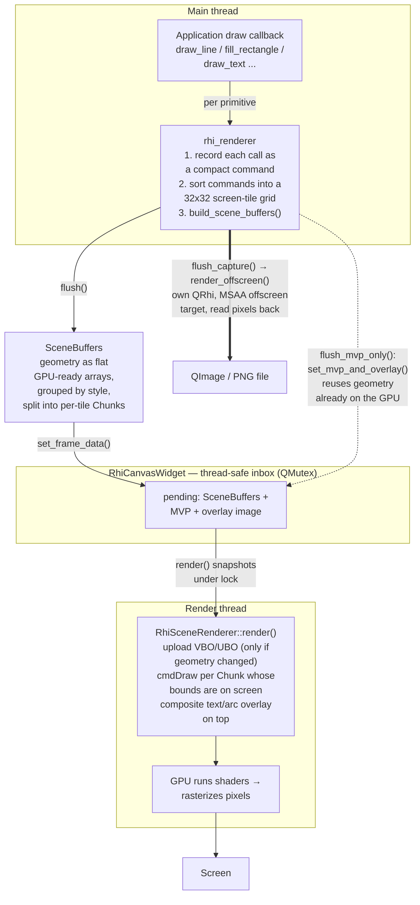

# The RHI Rendering Pipeline

This document explains how a drawing on screen is produced by the **`rhi`**
backend — the GPU-accelerated renderer that is ezgl's default. It follows one
piece of geometry (say, a single line) from the application's draw code to a lit
pixel, and shows where the data changes shape along the way.

> **New to the graphics acronyms** (GPU, VBO, UBO, MVP, NDC, MSAA, …)?
> They are all defined in the glossary at the top of
> [`include/ezgl/qt/rhi_types.hpp`](../include/ezgl/qt/rhi_types.hpp).
> This document assumes that glossary as background.

---

## The four players

The RHI path is split across four classes. Keeping them straight is most of
the battle:

| Class | Lives on | Job |
| ----- | -------- | --- |
| **`rhi_backend`** | main thread | Lifecycle wrapper. Owns the renderer, runs the app's draw callback, decides *full redraw* vs *camera-only* vs *headless*. |
| **`rhi_renderer`** | main thread | The **recording** side. Turns `draw_line`/`fill_rectangle`/… calls into compact data, sorts it into screen tiles, and packs it into a `SceneBuffers`. |
| **`RhiCanvasWidget`** | bridge | A `QRhiWidget`. Holds a thread-safe "inbox" of the next frame, and is the thing Qt actually paints. |
| **`RhiSceneRenderer`** | render thread | The **GPU** side. Owns all pipelines/buffers, uploads the geometry, and issues the draw calls that light pixels. |

The key idea: **the main thread describes *what* to draw; the render thread
decides *how* to push it to the GPU.** They hand off through the widget's inbox.

---

## The pipeline, in one diagram

Three kinds of arrow, one per path the backend can take:

- **solid** — *full redraw* (`redraw()`): the scene geometry changed.
- **dashed** — *camera-only* (`redraw_camera_only()`): you panned/zoomed, geometry is unchanged, so only the ~80-byte MVP matrix and the text overlay move.
- **thick** — *headless* (`render_to_image()`): render straight to a PNG with its own throw-away `QRhi`, no window, no render thread.

---

## How the data changes shape

The same line is represented four different ways on its journey. Understanding
*why it keeps getting repacked* is the heart of this pipeline:

| Stage | Representation | Set by |
| ----- | -------------- | ------ |
| 1. API call | `draw_line({0,0}, {10,5})` — world coordinates, human units | app callback |
| 2. Recorded command | `ThinLineCmd{ sk, 0,0, 10,5 }` — compact struct in a per-band bucket | `rhi_renderer` draw methods |
| 3. `SceneBuffers` | flat `verts[]` array + a list of `Chunk`s (each = one tile's slice + its bounding box) | `flush()` / `build_scene_buffers()` |
| 4. GPU draw | vertices in a VBO, color in a UBO; `cmdDraw` per on-screen chunk; vertex shader applies the MVP → pixels | `RhiSceneRenderer::render()` |

Why all this shuffling? Three payoffs, each explained in the source comments:

- **Group by style** (color + width + dash + kind = one `StyleKey`) → thousands of
  differently-colored lines still draw as one pipeline pass, with the color read
  from a small UBO instead of stored on every vertex. (See the "Why per-style UBO"
  note in [`rhi_types.hpp`](../include/ezgl/qt/rhi_types.hpp).)
- **Bin into tiles** → each tile carries a bounding box, so when you zoom in the
  GPU skips tiles that are off-screen without touching their vertex data.
- **Parallel tile sort** → the sort is split into horizontal *bands*, one worker
  thread each, writing disjoint tiles with no locking.

---

## Two threads, one inbox

The main thread and Qt's render thread run at the same time: the main thread can
record frame N+1 while the GPU still draws frame N. They never touch the same data
at once because the hand-off goes through the mutex-guarded inbox in the diagram
above. Two details make this safe and fast:

- The scene is passed as `shared_ptr<const SceneBuffers>`, so the render thread can
  keep drawing last frame's scene while the main thread builds the next one — no
  copy, no data race.
- The GPU keeps **2–3 frames in flight**, so each frame gets its own set of GPU
  buffers (`FrameResources`). New geometry is uploaded only to the slot being drawn;
  other slots refresh lazily from `m_cached_scene` next time they are used. (See the
  "Why several slots" note in
  [`rhi_scene_renderer.hpp`](../include/ezgl/qt/rhi_scene_renderer.hpp).)

---

## Where the overlay (text and arcs) fits

Text, arcs, and blitted images do **not** go through the GPU geometry path. They
are painted with a normal `QPainter` onto a transparent `QImage` (the *overlay*),
uploaded as a texture, and composited on top of the GPU-drawn geometry as the very
last step of `RhiSceneRenderer::render()` (the "composite … overlay on top" line in
the diagram). That is why text stays crisp and always sits above the lines and
fills, regardless of draw order.

---

## File map

| File | Role in the pipeline |
| ---- | -------------------- |
| [`rhi_types.hpp`](../include/ezgl/qt/rhi_types.hpp) | The data structures the geometry is packed into (`StyleKey`, `Chunk`, `SceneBuffers`, …) + the term glossary. |
| [`rhi_renderer.hpp`](../include/ezgl/qt/rhi_renderer.hpp) | Recording side: draw calls → tiles → `SceneBuffers`. |
| [`rhi_canvas_widget.hpp`](../include/ezgl/qt/rhi_canvas_widget.hpp) | The `QRhiWidget` + thread-safe inbox + headless helper. |
| [`rhi_scene_renderer.hpp`](../include/ezgl/qt/rhi_scene_renderer.hpp) | GPU side: pipelines, per-frame resources, upload + draw. |
| [`rhi_backend.hpp`](../include/ezgl/qt/rhi_backend.hpp) | Lifecycle wrapper that chooses full / camera-only / headless. |

For how the `rhi` backend compares to the `immediate` and `deferred` backends,
see [`renderers.md`](renderers.md).
